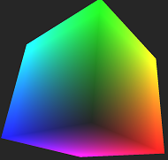

# Vertex Buffer Object Cube

This is a C++ class with an unitary cube to render with OpenGL using a vertex buffer object and a vertex array. It contains word and texture coordinates. The quad is defined in coordinates [-0.5, 0.5]^3.

The object is created as a singleton, and the object is stored in a Vertex Array Object and rendered with glDrawElements.

The cube can be rendered with:

```c++
    VBOCube::Instance().Draw();
```

or with:

```c++
    VBOCube::Instance().Setup();

    VBOCube::Instance().OnlyDraw();

    VBOCube::Instance().Stop();
```

The following is an screenshot of the rendered cube:


